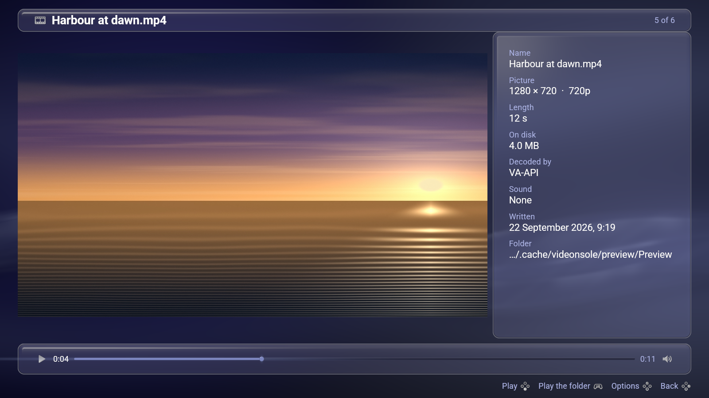

# Videonsole

**A film browser and player for [LineXinBar](https://github.com/Petexy/LineXinBar),
driven by a controller. It is shown as *Videos*.**

`videonsole` is the project, the package and the command; **Videos** is what it
is called on the desktop entry, in the menu and on the window — the same split
[Imagonsole](https://github.com/Petexy/imagonsole) has, which ships as
`imagonsole` and is shown as Pictures.

Built on [lxb-toolkit](https://github.com/Petexy/lxb-toolkit): the shell's own
colours, glass, motion, type and marks, so a folder of films sits beside the
shell rather than in front of it.


[](LICENSE)
[](VERSION)
[](Cargo.toml)

---

## What it is

```sh
videonsole                         # the videos folder
videonsole ~/Films                 # that folder
videonsole ~/Films/holiday.mkv     # that film, in its folder
```

A folder is a wall of films the light travels across. **Only the card being
looked at is drawn as something to press** — the rest are the frame and the
name. Each card wears a frame out of the film itself and how long it runs,
because a wall of identical film strips says only that there are twelve films
and a wall of frames says *which*. A film somebody has already started wears a
short accent bar along the bottom of its frame.

Names too long for their card are cut out of the middle, so the end that says
which episode this is survives along with the extension.

## Playing one


**A film opens out of the card it was pressed on, and goes back into it.** The
picture on that card grows until it fills the screen, and the wall of films
steps back and fades out behind it — the same gesture a page makes when a menu
opens over it, at the size of a whole change of page. Back runs the whole of it
in reverse: the picture shrinks into the card it came from, dissolving into the
card's own frame as it lands, while the wall comes forward and the black lifts.

One number drives the whole of it — where the picture is, how round its corners
are, how far the wall has stepped back, how black the screen is — so that all
of them land on the same frame.

**The card grows into its own poster while the film opens.** A film takes a
moment over its header, and the poster is the picture that was pressed, so
there is something to look at from the first frame rather than a black
rectangle and the word *Opening…*. The film comes up underneath it and the
poster fades as it arrives.

**A film that is playing has the whole screen, on black, and everything else
stands over it.** Press anything and the transport rises out of the bottom of
the window; four seconds later it goes back down and there is nothing on the
screen but the film. The picture does not move for it, nor for the details,
nor for the Options menu.

**The row of button hints is the one exception**, and deliberately so: it is
the same row in the same place on every page of this application and in the
shell beside it, so it is never folded into the control bar and never given a
panel of its own. The picture stops just above it instead — the only room
anything takes from a playing film, and it is given back the moment the hints
go.

**A film that is stopped is a picture on a page**, on the shell's own
wallpaper, with the page's furniture beside it rather than over it — because a
film somebody has paused is a film they are looking at rather than watching,
and a page is what you look at something on.

| | A pad | A keyboard, a mouse |
|---|---|---|
| in a folder, move | D-pad, left stick | arrows, `wasd`, `hjkl` |
| in a film, **move through it** | D-pad left/right | arrows left/right |
| in a film, **the volume** | D-pad up/down | arrows up/down, the wheel, `+` `-` |
| **scan through the film** | **the triggers** | — |
| play and pause; open a folder | **A** | Enter, Space |
| back, or **close** | **B** | Escape |
| the Options menu | **Y** | F10, Menu, right-click |
| play the whole folder | **Start** | `r` |
| the film before or after | **LB** / **RB** | Shift-Tab / Tab |

and, on a keyboard alone: `m` mute, `0` to `9` a tenth of the way through, `f`
fill the screen or fit to it, `b` start from the beginning, `c` the next
subtitle track, `i` the details, `n` `p` the next and previous film, `g` back
to the folder, `o` open another folder.

**Left and right move through the film; up and down are the volume.**
Unambiguous, and the two things a hand reaches for without looking. A press
moves ten seconds, and a held direction moves thirty and then sixty — so
crossing an hour is not a hundred and eighty presses — because a seek is a jump
and a jump has to be a number somebody can predict.

**The triggers scan**, which is the one control here that wants an amount
rather than an event: a fixed jump is right for a button and wrong for a thumb
resting on a trigger, which is asking to go *faster* rather than to go again. A
scan holds the film still and moves it by seeking, rather than playing it
faster — a soundtrack at four times speed is a noise, and what somebody
scanning is looking at is the picture.

**Back closes it at the top of the walk**, exactly as Imagonsole's does.
Whatever it was opened on is that top, and the legend says **Close** rather than
Back wherever pressing it would close.

## Where you left off

Remembered, and carried on from the next time that film is opened — the
transport says so once, and *Start from the beginning* on the Options menu is
how to say otherwise.

Two rules decide what is worth keeping, and between them they are the whole of
it. **A film barely started is not a film you left**: somebody who watched a
minute and went elsewhere did not ask to be put back there. **A film nearly
finished is finished**: the credits are not a place to resume, and landing
there on the next open is the one behaviour that makes people turn the feature
off — so reaching the end *forgets* a film rather than remembering the end of
it.

It is written down as the film plays rather than only on the way out, because a
television box is switched off at the wall.

## Subtitles

From inside the film, from a file beside it — `beach.srt`, `beach.en.srt`,
`beach.pl.forced.srt` — or from **any file you choose**, in SubRip, WebVTT or
SubStation, and read as Windows-1252 where they are not UTF-8, which is the
honest guess for a format that predates the question.

The Options menu lists every track with the one being shown ticked, *No
subtitles* above them, and **Add a subtitle file…** below. The list is there
whether the film has a track or not: a film with none is exactly the film
somebody wants to add one to.

**One is shown without being asked for** when somebody meant it: a track the
film marks *forced* — the flag that exists for the scene in another language —
or a file somebody put beside the film, which nobody downloads by accident. A
plain `default` flag is deliberately not enough: half the films anybody owns
carry an English track marked default, and turning subtitles on for every one
of them is what people go looking for a setting to stop.

They are set in the same face the interface is, with the same halo the shell
puts behind its own words over the wallpaper. They are lifted clear of the
transport while it is up and step out of the way of the Options menu, because
they are drawn in a pass of their own *after* the film's and are therefore over
everything — including a panel that is supposed to be over them.




## If the controller does nothing

```sh
videonsole --controllers
```

There are two completely different reasons a pad can appear to be ignored, and
from the outside they look identical: the application not reading it, or there
being no gamepad on the machine to read. That flag says which.

The second is more common than it sounds. **A controller whose driver is not in
the kernel presents no gamepad at all** — a Steam Controller run outside the
session shell that drives it appears as a mouse and a keyboard and nothing
else. Under LineXinBar the shell is that driver and the pad is there; on a plain
desktop, with neither the shell nor Steam running, `ls /dev/input/js*` finds
nothing.

`VIDEONSOLE_DEBUG_ACTIONS=1` in the environment prints every action the
application is driven by, and how far the triggers are pulled.

## What else it does

- **Decodes on the graphics card**, through VA-API where the machine has it and
  in software where it does not. *Decoded by* on the details pane says which,
  which is the answer to "why is this film stuttering" and there is nowhere
  else to find it. `VIDEONSOLE_HWACCEL=off` forces software — the first thing
  to try when one particular film looks wrong, because that separates a driver
  decoding a stream badly from the file being damaged.
- **The poster frames are everybody's.** They are written to
  `$XDG_CACHE_HOME/thumbnails/large` in the layout the freedesktop thumbnail
  specification lays down, which is the same cache the user's file manager
  fills and the same one **LineXinBar's own Video shelf reads**. A folder
  browsed here has pictures on the shell's bar afterwards, and a folder the
  shell has walked opens here with every card already drawn.
- **A film's pixels are not always square.** A disk stores a widescreen picture
  720 wide and writes the ratio beside it; drawing the stored size is the tall,
  thin picture everybody has seen at least once.
- **The order a person reads in.** `S01E09` before `S01E10`, which plain byte
  order gets exactly backwards.
- **Six sort orders**, folders first in all of them, hidden names on request.
- **Play the whole folder**, which for a folder of episodes is the thing it is
  for. It stops at the last one rather than coming round.
- **Somewhere else to look**: *Open another folder* puts the question to this
  desktop's own file chooser through the portal, and draws the toolkit's own
  where there is no portal to ask.

## How it is built

```text
src/main.rs        the window, the input, and --shot
src/view.rs        what is being watched, and what every control does to it
src/draw.rs        putting it on the screen
src/player.rs      opening a film, decoding it, keeping time, making a noise
src/film.rs        the film's frames on the graphics card
src/subtitles.rs   the words under it, and the one reason they are drawn there
src/poster.rs      the frame a film wears in the grid, and how long it runs
src/library.rs     what is in a folder, and in what order
src/resume.rs      where you left off
src/legend.rs      what the buttons do, drawn rather than spelled out
src/pad.rs         how far the triggers are pulled, and nothing else
src/facts.rs       how long, how large, how many pixels, and when
```

Three things are worth knowing before reading it.

**It draws its own window**, which most applications built on the toolkit do
not need to do. `Ui::picture` reads a *file* into one 512-pixel cell of a shared
atlas — exactly right for the card of a grid, and a film is not a file that can
be read once. Its frames arrive twenty-four times a second at their own size,
so the frame is composed by `lxb-render` as everywhere else and the film is
drawn over it in a pass of this application's own.

**Everything else follows from that.** The film is drawn *over* the composed
frame, so nothing the toolkit draws can appear on top of one. There are two
answers to that here, and which one is in force is the difference between
watching a film and looking at one.

**A stopped film gets a stage** — a rectangle it may occupy — and everything
else is laid out outside it. The transport narrows the stage and the film steps
aside; the details pane takes its room the same way; a dialog or the file
chooser takes the screen and the film fades out. That is why the stage is
animated state rather than a rectangle worked out while drawing.

**A playing film is punched through.** It has the whole window, and every panel
over it is a *hole*: a rounded rectangle the film's pass leaves alone, so what
the toolkit drew there survives untouched. The panels are still the toolkit's
own material — nothing is hand-painted — and the film is still drawn last.

Two things fall out of that. **A panel is the shape of its hole**, so anything
standing over a playing film has to be on a panel: a hole cut around a loose
word would be a rectangle of wallpaper cut out of the picture. That is why the
button hints are not over the film at all — the film gives up their band
instead, and takes it back the moment they go. And **a hole cannot fade**,
because it would open on that same rectangle and then dissolve into it, so the
chrome **slides** off the edges of the window.

**The black is this application's own.** `lxb-render` draws glass, light and
words, and has no way to be asked for a plain opaque rectangle of a colour it
did not choose — so the letterbox around a playing film is painted in the same
pass the film is. With one exception, and it is why `draw.rs` has a `blackout`
function: the hints' band has to be black *under* words the toolkit drew, and
this pass runs after the toolkit. There it is stacked out of the one call that
takes a colour at all.

**A change of page is drawn twice over.** Both pages are on the screen while a
film is opening or leaving, and the toolkit draws every quad of a layer before
every word of it — so a name on a card is drawn *over* whatever the same frame
puts on top of it, however late. `Ui::recede_behind` is the door on to both
halves of the answer: it steps the wall back and fades it out, and it takes the
words out from under the picture and the panels standing over them, in
proportion to how solid each of those is. It is the same call a menu makes over
the page it opens on.

The subtitle is the single exception, and it is drawn in a pass of its own
after the film's — in `glyphon`, the crate `lxb-render` sets all of its own type
with, loading the toolkit's own face. A different pass, and the same material.

**The colour is done on the graphics card.** A decoder hands back planes of
luma and chroma, not pixels; turning those into red, green and blue is twelve
megabytes of arithmetic per 4K frame that a graphics card does for nothing while
a processor doing it is a processor not decoding the next frame. So the planes
go up as they are and the shader converts, from the coefficients the film itself
declares. What that does *not* do is high dynamic range — a BT.2020 film with a
perceptual-quantiser curve goes through the standard-range path and will look
flat.

`pad.rs` is the one place this goes past `lxb-input`, and only for the triggers.
An action is a thing that happened and a trigger is a quantity, and there is no
honest way to say "sixty percent" in a list of actions.

## Build

```sh
cargo build --release
cargo run --release -- ~/Videos
```

It needs `lxb-toolkit` 0.9.0 installed — the crate sources it compiles against
live in `/usr/share/lxb-toolkit/crates`. Nothing of the toolkit is linked at run
time; cargo compiles it in.

**ffmpeg is different.** Unlike every other application on this toolkit, this
one links libavcodec and its neighbours outright and needs them at run time:

```sh
readelf -d target/release/videonsole | grep NEEDED
```

## Verify

```sh
cargo test --release --locked
cargo clippy --all-targets --locked -- -D warnings
cargo fmt --check
```

and the one worth knowing about:

```sh
videonsole --shot page.png ~/Videos --width 1600 --height 900
videonsole --shot film.png ~/Videos/holiday.mkv --at 90 --details
```

`--shot` writes one settled frame to a PNG **with no display at all**, through
the same renderer and the same film and subtitle passes the window uses. Every
animation is put where it is going first, so what it photographs is the page at
rest. It takes `--play`, `--pause`, `--details`, `--menu`, `--row N`,
`--at SECONDS` and `--subtitle FILE`, and each is applied *after* a frame has
been measured — exactly as a real press is. Every screenshot above was taken
that way.

`--after SECONDS` is the exception, and the only way to photograph an
*animation*: the page is settled first, then pressed, and the picture is taken
exactly that long afterwards. Which press waits is
`--then play|back|details|menu` (`--back` is the same as `--then back`);
everything else asked for happens before the loop, settled.

```sh
videonsole --shot opening.png ~/Videos --play --after 0.17
videonsole --shot leaving.png ~/Videos --play --back --after 0.17
```

`--pause` is the one to reach for when a shot comes out looking wrong: a film
named on the command line opens *playing*, which is the state where it has the
whole window and the chrome is holes cut in it. Stopping it is the only way to
photograph the page a film stands aside on.

The colour path is worth checking against the library itself rather than by
eye:

```sh
ffmpeg -ss 90 -i film.mkv -frames:v 1 -pix_fmt rgb24 -f rawvideo ref.rgb
```

and comparing a flat area with the same pixel of a `--shot`. On a film that
declares its colour space they agree to within a count or two. On one that
declares nothing they will not: this reads an untagged HD film as BT.709, which
is what every player does and what real HD content is, while `swscale`'s own
default for an untagged stream is BT.601.

## Install

```sh
./packaging/install.sh --destdir /tmp/stage
```

or a real package:

```sh
./packaging/build.sh arch      # | debian | fedora | nix
./packaging/build.sh check     # what a package would have to agree with
```

See [`packaging/README.md`](packaging/README.md).

## Languages

English and Polish, in whichever one the session speaks — on LineXinBar, the
one Settings > Language names. See [localization](docs/localization.md) for the
catalogs, how to look at a page in the other language, and how to add one.

## Licence

[GPL-3.0-only](LICENSE), matching LineXinBar and the toolkit.
