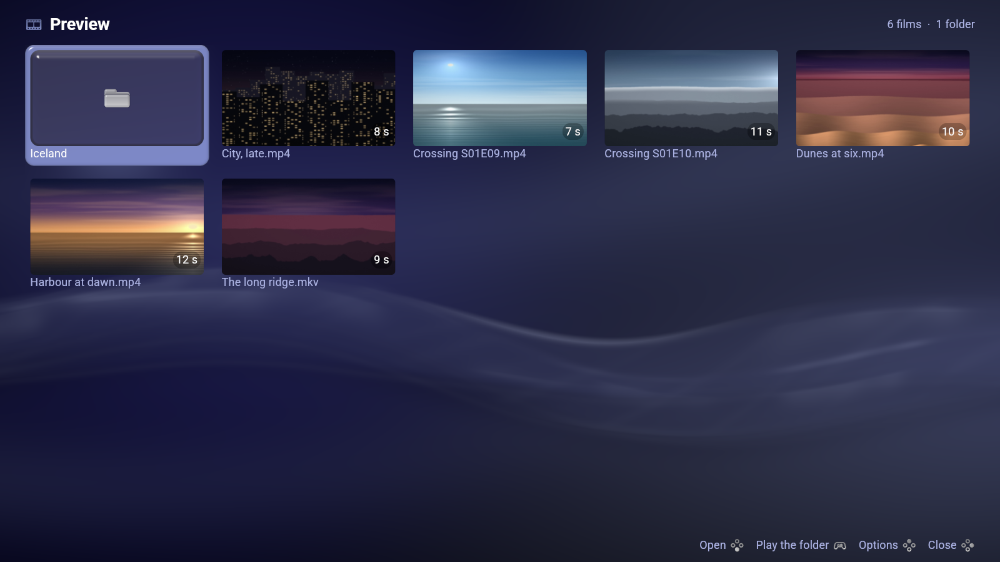
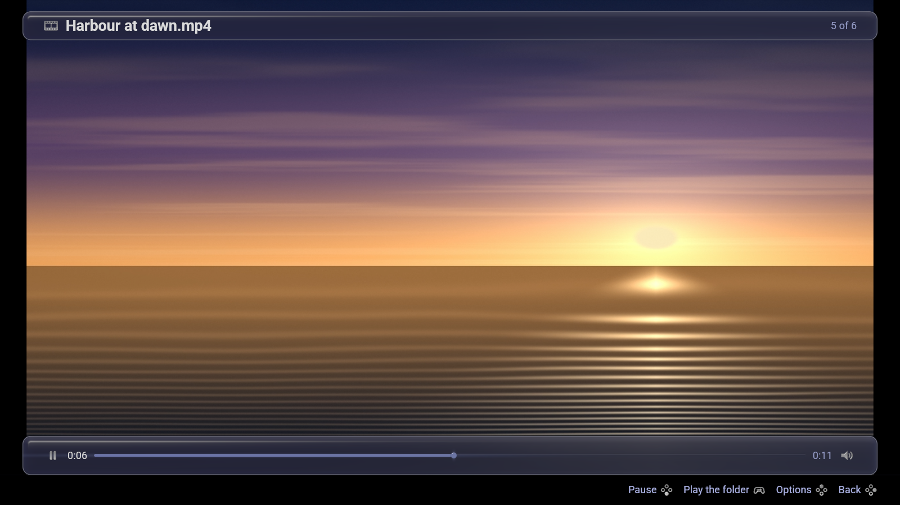
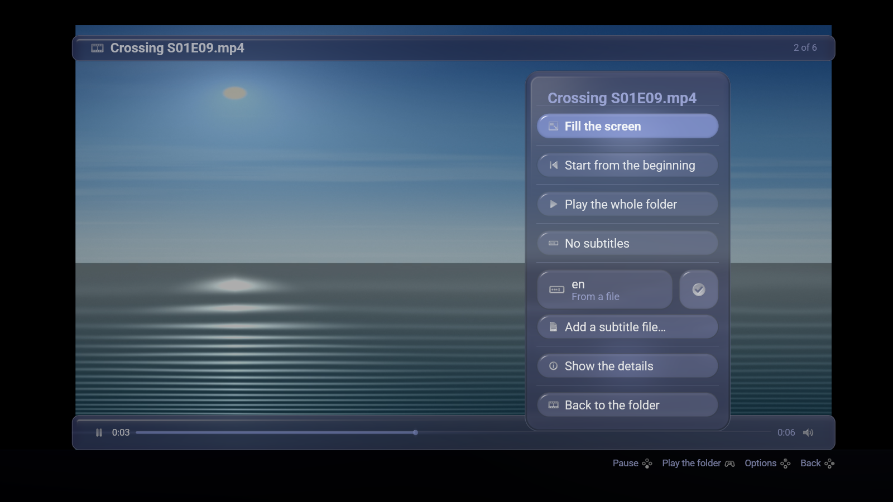

# Videonsole

**A film browser and player for [LineXinBar](https://github.com/Petexy/LineXinBar),
driven by a controller. It is shown as *Videos*.**

[](LICENSE)
[](VERSION)
[](Cargo.toml)



`videonsole` is the project, the package and the command; **Videos** is what it
is called on the desktop entry, in the menu and on the window. It is built on
[lxb-toolkit](https://github.com/Petexy/lxb-toolkit) — the shell's own colours,
glass, motion, type and marks — and it is an ordinary Wayland application, so
it runs under GNOME or Plasma as readily as under the shell it was made for.

Its siblings are [Imagonsole](https://github.com/Petexy/imagonsole) (Pictures),
[SongOnSole](https://github.com/Petexy/songonsole) (Music) and
[DistriBumpy](https://github.com/Petexy/distribumpy) (Software Hub).

## Use

```sh
videonsole                         # the videos folder
videonsole ~/Films                 # that folder
videonsole ~/Films/holiday.mkv     # that film, in its folder
videonsole --demo                  # a made-up folder; nothing of yours is touched
```

A folder is a wall of films the light travels across. **Only the card being
looked at is drawn as something to press** — the rest are the frame and the
name. Each card wears a frame out of the film itself and how long it runs,
because a wall of identical film strips says only that there are twelve films
and a wall of frames says *which*. A film somebody has already started wears a
short accent bar along the bottom of its frame.



## What it does

- **A film opens out of the card it was pressed on**, and goes back into it.
  One number drives the whole crossing — where the picture is, how round its
  corners are, how far the wall has stepped back, how black the screen is — so
  that all of them land on the same frame.
- **A playing film has the whole screen**, on black, and everything else stands
  over it. Press anything and the transport rises; four seconds later it goes
  back down. A film that is *stopped* is a picture on a page instead, with the
  page's furniture beside it rather than over it.
- **Where you left off is remembered**, and carried on from next time. Two
  rules decide what is worth keeping: a film barely started is not a film you
  left, and a film nearly finished is finished — so reaching the end *forgets*
  a film rather than landing you in the credits.
- **Subtitles** from inside the film, from a file beside it (`beach.srt`,
  `beach.en.srt`, `beach.pl.forced.srt`) or from any file you choose, in
  SubRip, WebVTT or SubStation. One is shown without being asked for only when
  somebody meant it: a *forced* track, or a file somebody put there. A plain
  `default` flag is deliberately not enough.
- **Decodes on the graphics card** through VA-API where the machine has it, and
  in software where it does not. *Decoded by* on the details pane says which,
  which is the answer to "why is this film stuttering".
  `VIDEONSOLE_HWACCEL=off` forces software.
- **The poster frames are everybody's** — written to
  `$XDG_CACHE_HOME/thumbnails/large` in the freedesktop layout, which is the
  same cache the file manager fills and **LineXinBar's own Video shelf reads**.
- **The order a person reads in**: `S01E09` before `S01E10`, which plain byte
  order gets exactly backwards. Six sort orders, folders first in all of them.
- **Play the whole folder**, which for a folder of episodes is the thing it is
  for. It stops at the last one rather than coming round.
- **A film's pixels are not always square**, and the stored ratio is honoured.
- **Somewhere else to look**: *Open another folder* puts the question to this
  desktop's own file chooser through the portal, and draws the toolkit's own
  where there is no portal to ask.



## Controls

A controller, a keyboard and a pointer are one interface rather than three.
Nothing here is a controller *mode*.

| | A pad | A keyboard, a mouse |
|---|---|---|
| in a folder, move | D-pad, left stick | arrows, `wasd`, `hjkl` |
| in a film, **move through it** | D-pad left/right | arrows left/right |
| in a film, **the volume** | D-pad up/down | arrows up/down, the wheel, `+` `-` |
| **scan through the film** | **the triggers** | — |
| play and pause; open a folder | **A** | Enter, Space |
| back, or **close** | **B** | Escape |
| the Options menu | **Y** | F10, Menu, right-click |
| play the whole folder | **Start** | `r` |
| the film before or after | **LB** / **RB** | Shift-Tab / Tab |

and, on a keyboard alone: `m` mute, `0` to `9` a tenth of the way through, `f`
fill the screen or fit to it, `b` start from the beginning, `c` the next
subtitle track, `i` the details, `n` `p` the next and previous film, `g` back
to the folder, `o` open another folder.

**Left and right move through the film; up and down are the volume** — the two
things a hand reaches for without looking. A press moves ten seconds, and a
held direction moves thirty and then sixty. **The triggers scan**, which is the
one control here that wants an amount rather than an event.

If a pad seems to be ignored:

```sh
videonsole --controllers
```

A controller whose driver is not in the kernel presents no gamepad at all, and
from the outside that looks exactly like an application that is not reading it.
That flag says which it is. `VIDEONSOLE_DEBUG_ACTIONS=1` prints every action
the application is driven by.

## Install

Rust 1.87 or newer, and the **lxb-toolkit development component** —
`Cargo.toml` names its crate sources at `/usr/share/lxb-toolkit/crates`, and
cargo compiles them into this binary, so nothing of the toolkit is linked at
run time. Beside that: **ffmpeg** and **alsa-lib** with their development
files, which this one links outright and needs at run time.

```sh
cargo build --release --locked
sudo ./packaging/install.sh --destdir / --prefix /usr
```

`install.sh` places the binary, the desktop entry, the icon and the AppStream
data, and nothing else. For a user-local install instead, with `~/.local/bin`
on `PATH`:

```sh
./packaging/install.sh --destdir / --prefix "$HOME/.local"
```

### As a package

Every recipe calls that same `install.sh`, so a package cannot quietly ship a
different set of files from the line above.

```sh
./packaging/build.sh check     # what a package would have to agree with
./packaging/build.sh arch      # makepkg
./packaging/build.sh debian    # dpkg-deb, on Debian or Ubuntu
./packaging/build.sh fedora    # rpmbuild, on Fedora
./packaging/build.sh nix       # the flake — the one target that does not
                               # need lxb-toolkit installed already
```

Or with Nix and no checkout at all:

```sh
nix run github:Petexy/videonsole
```

See [`packaging/README.md`](packaging/README.md) for why the toolkit is a
*build* dependency and not a runtime one.

## Verify

```sh
cargo test --release --locked
cargo clippy --all-targets --locked -- -D warnings
cargo fmt --check
```

`--shot` writes one settled frame to a PNG **with no display at all**, through
the same renderer and the same film and subtitle passes the window uses. Every
animation is put where it is going first, so what it photographs is the page at
rest. `--after SECONDS` is the one way to photograph an *animation*: the page
is settled, then pressed, then the picture is taken that long afterwards.

```sh
videonsole --demo --shot page.png --width 1600 --height 900
videonsole --demo --shot film.png --width 1600 --height 900 --row 5 --play --at 6
```

Every picture in this README was taken that way. `--demo` draws a made-up
folder of films into this application's own cache and opens that: nothing of
yours is read and nothing of yours is written.

## Languages

Ten, compiled in: German, English (UK), English (US), Spanish, French, Hindi,
Polish, Brazilian Portuguese, Russian and Simplified Chinese — in whichever one
the session speaks, which on LineXinBar is the one Settings ▸ Language names.
See [localization](docs/localization.md).

## How it is put together

| | |
|---|---|
| `src/main.rs` | The window, the input, and `--shot` |
| `src/view.rs` | What is being watched, and what every control does to it |
| `src/draw.rs` | Putting it on the screen |
| `src/player.rs` | Opening a film, decoding it, keeping time, making a noise |
| `src/film.rs` | The film's frames on the graphics card |
| `src/subtitles.rs` | The words under it, and the one reason they are drawn there |
| `src/poster.rs` | The frame a film wears in the grid, and how long it runs |
| `src/library.rs` | What is in a folder, and in what order |
| `src/resume.rs` | Where you left off |
| `src/legend.rs` | What the buttons do, drawn rather than spelled out |
| `src/pad.rs` | How far the triggers are pulled, and nothing else |
| `src/demo.rs` | The made-up folder behind `--demo` |
| `src/facts.rs` | How long, how large, how many pixels, and when |

**[`docs/design.md`](docs/design.md)** is the long answer: why this application
draws its own window, how a panel over a playing film is a *hole* rather than a
layer, where the black comes from, and what the colour path does and does not
do.

## Licence

[GPL-3.0-only](LICENSE), matching LineXinBar and the toolkit. It releases under
the same version as LineXinBar, lxb-toolkit, Imagonsole, SongOnSole,
DistriBumpy and CEDM.
